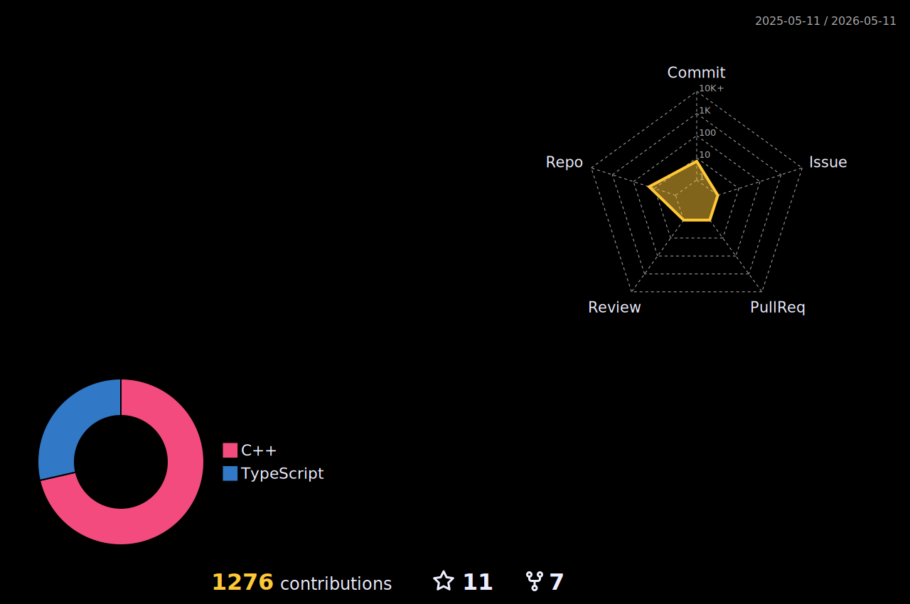

<h1 align="center">
  
  Hello, &lt;coders/&gt;!
  
</h1>

 
 

- 🪔  **अप्प दीपो भव:**  (Be your own light)
<!-- - 🔭 I’m currently studing **Programming and Data Science** at **IIT, Madras.** -->
- 🌱 I’m currently learning **Python and Qt.**
- 👯 I’m looking to collaborate on **Image processing.**
- 💬 Ask Me About Anything [here](https://github.com/dwijmistry11/dwijmistry11/issues/1) ! I am happy to help.
 

<!--    •   -->
   •   
  

#
 
<!--  -->

<!-- # -->

  

-----
Last Edited on: 17/Jan/2022

<!-- #

 

**𝙻𝙰𝙽𝙶𝚄𝙰𝙶𝙴𝚂 𝙰𝙽𝙳 𝚃𝙾𝙾𝙻𝚂:**  
 
 
<code></code>
<code></code>
<code></code>
<code></code>
<code></code>
<code></code>
<code></code>
<code></code>
<code></code>
<!-- <code></code> -->
<!-- #
<code></code>
<code></code>
<code></code>
<code></code>
<code></code>
<code></code>
<code></code>
<code></code>
<code></code>
<!-- <code></code> -->

