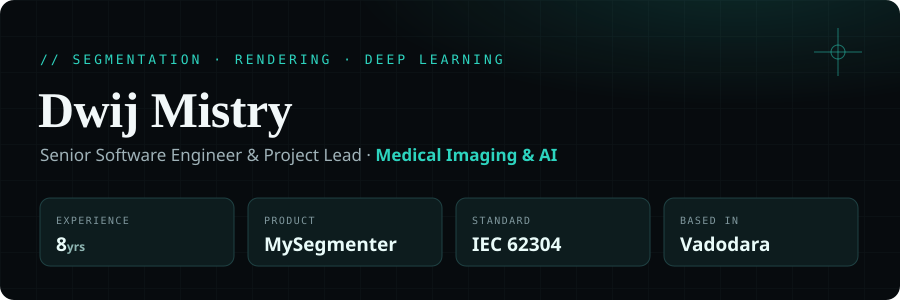

  

### `// about`

I build high performance, regulated medical imaging software in **C++, Python, and Qt**. I lead **MySegmenter** at 3D Surgical from architecture to deployment under ISO 13485, ISO 14971, and IEC 62304, supporting FDA 510(k). Lately I ship deep learning auto segmentation with **nnU-Net** for craniomaxillofacial and knee anatomy, integrated straight into the live clinical pipeline.

### `// capabilities`

**Languages**  

**Imaging &amp; AI**  

**Tooling**  

**Practice**  

### `// timeline`

**Senior Project Lead · Jajal Medical Services** · *MySegmenter / 3D Surgical* · Oct 2021 to present
- Lead architecture to deployment of MySegmenter, a C++ and Qt imaging and segmentation suite.
- Designed a plugin and API framework that cut new feature development time by about half.
- Built segmentation analytics and 3D rendering on VTK and ITK, and shipped nnU-Net inference to production.

**R&amp;D Software Engineer · MQS Technologies** · Hyderabad · Aug 2018 to Sep 2021
- Real time controller for the SAMEER LINAC project (MeitY), built to BARC standards.
- Automated the INVAR Amplifier test protocol (Bharat Dynamics, MoD) with parallel test strategies.
- Integrated MedeQuip imaging software with flat panel detectors and CT systems.

### `// recognition`

- 🏅 **IEEE India Council — Best Industry Mentor**, Career Mentoring Program 2025
- 📜 Certified Scrum Product Owner (CSPO), Scrum Alliance
- 🎤 Speaker, IEEE NaSCoVIP 2022 (Gujarat Section)

### `// connect`

अप्प दीपो भव: · be your own light
