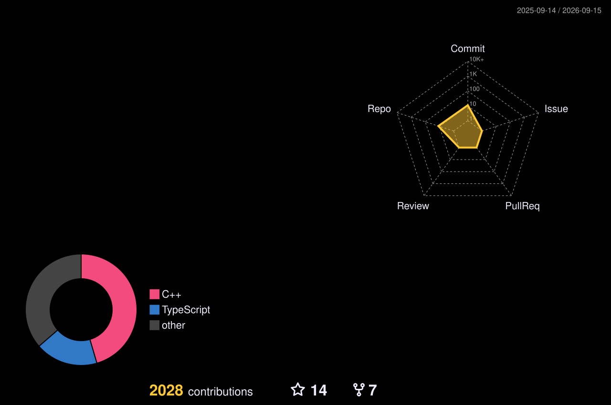

<image src="assets/dwij.gif">

<table style="width: 100%; border: 0px; text-align: left; vertical-align: top; padding: 20px; margin-left: auto; margin-right: auto">
 <tr>
  <td>
🪔 अप्प दीपो भव: (Be your own light)  

🌍  Based in Vadodara, India 
🧠  Senior Software Engineer and Project Lead in Medical Imaging and AI 
🖥️  Portfolio at [dwij.dev](https://dwij.dev) and [LinkedIn](http://www.linkedin.com/in/dwijmistry11/) 
✉️  Reach me at [dwijmistry11@gmail.com](mailto:dwijmistry11@gmail.com) 
🔬  Building C++ and Python imaging software and deep learning segmentation for regulated medical devices 
🤝  Open to collaborating on AI and ML for healthcare imaging 
⚡  The only way to do great work is to love what you do.  

<h3 align="center">Skills</h3>

<h3 align="center">Socials</h3>

   

  </td>
  <td>
   
   </td>
 </tr>

</table>
  

## About me

Senior software engineer with about 8 years building high performance, regulated medical imaging and embedded software in C++, Python, and Qt. I lead **MySegmenter** (3D Surgical), a clinical imaging and segmentation suite, from architecture to deployment under ISO 13485, ISO 14971, and IEC 62304, supporting FDA 510(k). Recently I built deep learning auto segmentation with **nnU-Net** for craniomaxillofacial and knee anatomy and integrated inference into the live clinical workflow. Certified Scrum Product Owner and IEEE India Council Best Industry Mentor 2025.

## What I work with

- **Languages:** C++, Python, C, Embedded C, SQL
- **Imaging and AI:** VTK, ITK, nnU-Net, deep learning segmentation, CT and MRI processing, dataset preparation and annotation, training and inference pipelines
- **Frameworks and tools:** Qt5, CMake, Git, Jira, Confluence, LabVIEW, MATLAB
- **Practice:** Software architecture, performance optimization, Agile and Scrum, SDLC, regulated software (ISO 13485, ISO 14971, IEC 62304, FDA 510(k))

## Experience

**Jajal Medical Services** — Vadodara, India · *product: MySegmenter / 3D Surgical*
*Senior Software Engineer to Project Lead to Senior Project Lead* · Oct 2021 to Present
- Lead architecture to deployment of MySegmenter, a C++ and Qt medical imaging and segmentation suite built to ISO 13485, ISO 14971, and IEC 62304 and supporting FDA 510(k) clearance.
- Designed an extensible plugin and API framework with custom licensing and third party integrations, cutting new feature development time by about half.
- Built segmentation analytics and 3D rendering modules on VTK and ITK, broadening the supported clinical workflows.
- Developed nnU-Net auto segmentation for CMF and knee anatomy across CT and MRI, from preprocessing to training and validation, and integrated inference into the production pipeline.

**MQS Technologies** — Hyderabad, India
*R&D Software Engineer (Trainee to Software Engineer to Senior)* · Aug 2018 to Sep 2021
- Optimized industrial imaging software through profiling and refactoring, and led code quality and performance training for the team.
- Built a real time controller for the SAMEER LINAC project (MeitY, Govt. of India) integrating with the modulator to BARC standards, with predictive maintenance monitoring.
- Automated the INVAR Amplifier test protocol (Bharat Dynamics, MoD), parallelizing test strategies to cut test time and raise throughput.
- Integrated MedeQuip imaging software with flat panel detectors and CT systems for real time radiography in defense, aerospace, and industrial use.

## Education and recognition

- **B.E., Electronics and Communication Engineering** — Sardar Vallabhbhai Patel Institute of Technology, 2017
- **IEEE India Council Best Industry Mentor**, Career Mentoring Program 2025
- Speaker, IEEE NaSCoVIP 2022 (Gujarat Section) · Silver Medal, National Kala Sarthi Art Award

<h3>Badges</h3>

<h3>My GitHub Stats</h3>

<table>
<td>

</td>
<td>

</td>

</table>

Last Edited on: 06/09/2026
