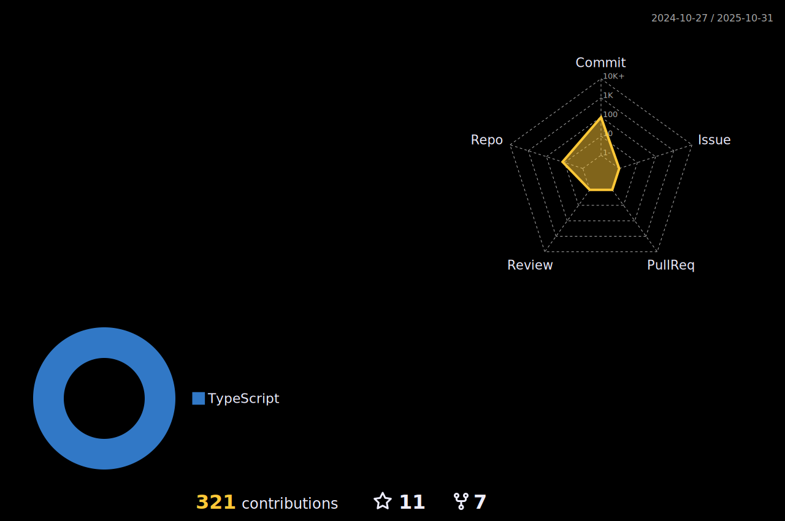

Hi 👋 My name is Dwij
=====================

Project Lead
------------

🪔 अप्प दीपो भव: (Be your own light)

* 🌍  I'm based in India
* 🖥️  See my portfolio at [LinkedIn](http://www.linkedin.com/in/dwijmistry11/)
* ✉️  You can contact me at [hello@dwijmistry.com](mailto:hello@dwijmistry.com)
* 🧠  I'm learning Machine vision
* 🤝  I'm open to collaborating on AI - ML
* ⚡  The only way to do great work is to love what you do.

### Skills

### Socials

   

### Badges

<b>My GitHub Stats</b>

### Support Me

-----
Last Edited on: 22/April/2022
